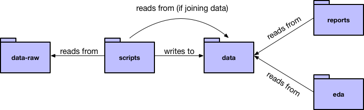

# Project workflow

This repository provides a sample project organization using data on bird collisions
in Chicago. 

The bird collision data is from 

> Winger BM, Weeks BC, Farnsworth A, Jones AW, Hennen M, Willard DE (2019) Data from: Nocturnal flight-calling behaviour predicts vulnerability to artificial light in migratory birds. Dryad Digital Repository. https://doi.org/10.5061/dryad.8rr0498

The following is a brief description of our recommended workflow and organization. 

## Create an RStudio project

The first step is to create an RStudio project for your directory. The project should live at the top level of your directory. 

* Click on the project drop-down menu in the upper-right corner of RStudio. 
* Select _New Project_.
* Select _Create project from existing directory_. Select your directory.

You should now have a file called __[your directory's name].Rproj__. Now, every time you want to work on your project, open this RStudio project. 

## Setup your folders

Now, create your folders. We suggest you use the following folders:

* __data-raw__: raw data
* __scripts__: data cleaning scripts
* __data__: cleaned data
* __eda__: exploratory data analysis on your cleaned data
* __reports__: findings to present to others

The following sections explain the contents of each folder in more detail.

### data-raw

This folder is for your raw data (i.e., the data that you haven't touched yet). 

For each data file, come up with a short, but descriptive, name. You'll use these names to name other files.

If you're worried about your files being too large to push to GitHub, you can adjust the .gitignore so that git won't track anything in this folder. The example .gitignore specifies that git should ignore everything in __data-raw__ and __data__.

### scripts

This folder is for your data-cleaning scripts. Each script reads in raw data, cleans it, and writes the cleaned data to a .rds file in the __data__ folder.

You should have one script for each raw data source. Name each script the same name as the raw data source. For example, one of our raw data files is named _birds.csv_. The script that cleans _collisions.csv_ is called _collisions.R_, and _collisions.R_ writes the cleaned data to _collisions.rds_. 

If you want to join multiple data sources, create an additional script that joins the cleaned data files. For example, _bird_collisions_light.R_ joins _birds.rds_, _collisions.rds_, and _light_mp.rds_, and writes to _bird_collisions_light.rds_. As the diagram points out, your joining scripts can join cleaned data from __data__. 
  
We recommend having a clear, common format for your scripts. See _template.R_ for our template. Specifically, we recommend always separating parameters from code and describing the purpose of each script in comments. 

### data

This folder contains cleaned data (in .rds format) that is ready to analyze. Each .rds file should have the same name as its corresponding raw data file and cleaning script.

If you joined data, that cleaned data should be here too. The cleaned and joined data should have the same name as the script that carried out the joining.

### eda

This folder contains RMarkdown files with your EDA work. Create one RMarkdown file for each cleaned data set that you want to explore.

Again, match the names of these files to your data files and cleaning scripts. For example, _birds.Rmd_ performs EDA on just _birds.rds_, _bird_collisions_light.Rmd_ performs EDA on just _bird_collisions_light.rds_, etc.

### reports

This folder contains reports on your data. These don't need to be named according to the convention of the other files. For example, our __reports__ folder just has one report called _report.Rmd_. 

## Use `here::here()` for file paths

Say you want to give the file path for _collisions.csv_ in _collisions.R_. One way to specify the file would be to give the file path relative to the scripts folder: _../data-raw/collisions.csv_. However, this will only work if you set your working directory to the _scripts_ folder every time you run your script. It also means you have to think about where folders are located relative to each other.

The here package makes this process easier. The function `here::here()` allows you to specify a file path relative to the directory of your .Rproj file, no matter what folder you're in. For example, with `here::here()`, you give the file path of _collisions.csv_ as _data-raw/collisions.csv_.

See the example scripts, EDA documents, and reports for examples.
