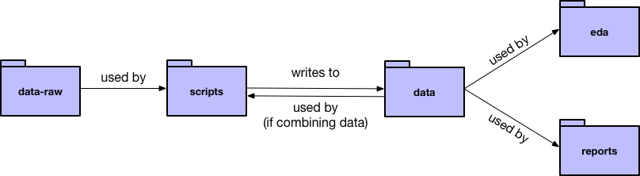

# Project workflow

This repository provides a sample project organization using data on bird collisions
in Chicago. 

The bird collision data is from 

> Winger BM, Weeks BC, Farnsworth A, Jones AW, Hennen M, Willard DE (2019) Data from: Nocturnal flight-calling behaviour predicts vulnerability to artificial light in migratory birds. Dryad Digital Repository. https://doi.org/10.5061/dryad.8rr0498

The following is a brief description of our recommended workflow and organization. 

## Create an RStudio project

The first step is to create an RStudio project for your directory. The project should live at the top level of your directory. 

* Click on the project drop-down menu in the upper-right corner of RStudio. 
* Select _New Project_.
* Select _Create project from existing directory_. Select your directory.

You should now have a file called __[your directory's name].Rproj__. Now, every time you want to work on your project, open this RStudio project. 

## Setup your folders

Now, create your folders. We suggest you use the following folders:

* __data__: cleaned data
* __data-raw__: raw data
* __eda__: exploratory data analysis on your cleaned data
* __scripts__: data-cleaning scripts
* __reports__: findings to present to others

The following sections explain the contents of each folder in more detail.

### data-raw

This folder is for your raw data (i.e., the data that you haven't touched yet). 

For each data file, come up with a short, but descriptive, name. You'll use these names to name other files.

If you're worried about your files being too large to push to GitHub, you can adjust the .gitignore so that git won't track anything in this folder. The example .gitignore specifies that git should ignore everything in __data-raw__ and __data__.

### scripts

This folder is for your data-cleaning scripts. Each script reads in raw data, cleans it, and writes the cleaned data to a .rds file in the __data__ folder.

You should have one script for each raw data source. Name each script the same name as the raw data source. For example, one of our raw data files is named __birds.txt__. The script that cleans __collisions.csv__ is called __collisions.R__, and __collisions.R__ writes the cleaned data to __collisions.rds__. 

If you want to join multiple data sources, create an additional script that joins the cleaned data files. For example, __bird_collisions_light.R__ joins __birds.rds__, __collisions.rds__, and __light_mp.rds__, and writes to __bird_collisions_light.rds__. As the diagram points out, your joining scripts can join cleaned data from __data__. 
  
We recommend having a clear, common format for your scripts. See __template.R__ for our template. Specifically, we recommend always separating parameters from code and describing the purpose of each script in comments. 

### data

This folder contains cleaned data (in .rds format) that is ready to analyze. Each .rds file should have the same name as its corresponding raw data file and cleaning script.

If you joined data, that cleaned data should be here too. The cleaned and joined data should have the same name as the script that carried out the joining.

### eda

This folder contains R Markdown files with your EDA work. Create one R Markdown file for each cleaned data set that you want to explore.

Again, match the names of these files to your data files and cleaning scripts. For example, __birds.Rmd__ performs EDA on just __birds.rds__, __bird_collisions_light.Rmd__ performs EDA on just __bird_collisions_light.rds__, etc.

### reports

This folder contains reports on your data. These don't need to be named according to the convention of the other files. For example, our __reports__ folder just has one report called __report.Rmd__. 

## Use `here::here()` for file paths

Say you want to give the file path for __collisions.csv__ in __collisions.R__. One way to specify the file would be to give the file path relative to the scripts folder: `"../data-raw/collisions.csv"`. However, this will only work if you set your working directory to the __scripts__ folder every time you run your script. It also means you have to think about where folders are located relative to each other.

The here package makes this process easier. The function `here::here()` allows you to specify a file path relative to the directory of your .Rproj file, no matter what folder you're in. For example, with `here::here()`, you give the file path of __collisions.csv__ as `here::here("data-raw/collisions.csv")`.

See the example scripts, EDA documents, and reports for examples.

## Make

Imagine __birds.txt__, our example raw data set, gets updated. Maybe the original owners added new birds, or corrected a mistake that they noticed. __birds.rds__, our cleaned version of this data, depends on __birds.txt__. __bird_collisions_light.rds__, our cleaned and joined data, also depends on __birds.txt__, as do some of our EDA files and reports. To update all these files, we could rerun __birds.R__ to regenerate __birds.rds__ and __bird_collisions_light.R__ to regenerate __bird_collisions_light.rds__. Then, we could re-knit the relevant EDA files and reports so that they use the updated data. However, manually updating all our files can get tedious. It also requires remembering which files depend on each other, which can get complicated. 

_Makefiles_ are a better way to keep track of dependencies and update files when there are changes. We've created a makefile for this example project. It specifies which files depend on each other, as well as what to do when certain files changes (e.g., run the script or knit the R Markdown file).

Makefiles are read by a program called Make. Make looks for changes in the files specified in the makefile. Then, it rebuilds the files that depend on the files that changed, based on the dependency structure given in the makefile.

Importantly, Make will only rebuild files affected by a change. For example, say __birds.txt__ changes. Because of how our makefile is set up, Make will re-rerun __birds.R__ and __bird_collisions_light.R__, which will re-write to __birds.rds__ and __bird_collisions_light.rds__. Then, Make will re-knit the EDA files __birds.Rmd__ and __bird_collisions_light.Rmd__, as well as our report __report.Rmd__. However, it will not re-rerun __collisions.R__, re-knit __collisions.Rmd__, etc., because these other files do not depend on __birds.txt__.

[Gnu Make](https://www.gnu.org/software/make/) is free software and comes installed on Macs and most Unix machines. If you're a Windows user, you might need to install Make yourself.

### Running Make

To run Make, navigate to your project directory from the command line. Then, type `make` and hit enter. 

### Creating a makefile

You'll need to edit the example makefile in order for Make to work for you. If you're using our recommended folder organization, you should be able to re-use a lot of the example file.

#### Search path
  
`VPATH = data data-raw eda reports scripts`
  
This variable provides the names of all the folders where Make should look for your files. If you used our recommended folder organization, you shouldn't have to change anything. If you used different folder names (or have additional folders), just change the names. Make sure to separate the folders with a single space.

#### Targets
    
`all : $(data) $(eda) $(reports)` defines a _target_ called `all`. The variables `data`, `eda`, and `reports` are defined on lines 4-11. 
    
This line tells Make to, by default, consider all the files defined by `data`, `eda`, and `reports`. 
    
If you used the recommended folder organization, you won't need to change line 14. However, you will need to change the contents of `data`, `eda`, and `reports` to reflect the names of your files. 
    
#### Dependencies

Now, you need to specify the _dependencies_ of your project. Lines 16-27 define our dependencies. 

File A depends on File B if changing File B can change File A. For example, `birds.md` depends on `birds.rds` because changing the cleaned data in `birds.rds` could change the analysis, visualizations, etc. in `birds.md`.

Create a line for each file in your project that depends on at least one other file. Specify the dependencies by using the following syntax:

`[target file] : [dependency file 1] [dependency file 2] [dependency file 3]`

Your files can have any number of dependencies, but make sure to separate the dependencies with a single space. If your need more than one line for your dependencies, end all lines except the last with a "\".

#### Rules

Finally, you need to tell Make how to update different types of files. We want Make to run a script if raw data changes, but knit an R Markdown document if cleaned data changes. Lines 30-33 define our rules. 

You probably won't need to update these rules, but it's useful to understand them. 

The first rule (lines 30-31) tells Make how to update a .rds file. For example, say __birds.txt__ changes. Make knows that __birds.rds__ depends on __birds.txt__ because of our specified dependencies. Make then looks to our first rule to figure out how to update __birds.rds__. The rule says to run the R Script with the same name as the .rds file. In our example, that script is __birds.R__, so Make will run __birds.R__.

The second rule (32-33) tells Make how to update a .md file. The rule tells Make to knit the .Rmd version of the relevant .md file. For example, if __birds.md__ needs updating (because __birds.rds__ changed), Make will knit __birds.Rmd__.

