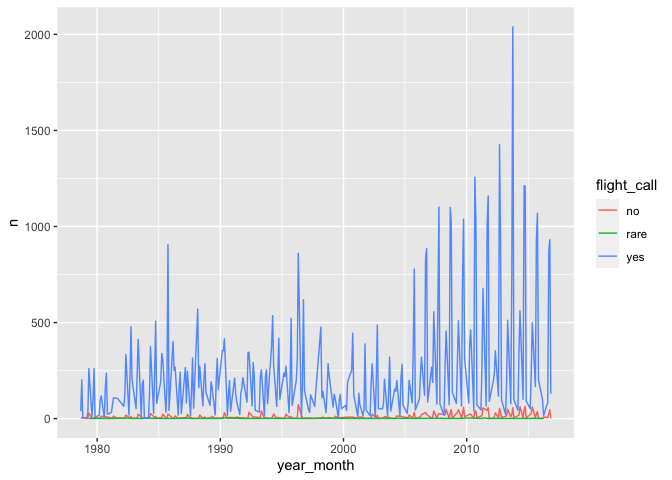
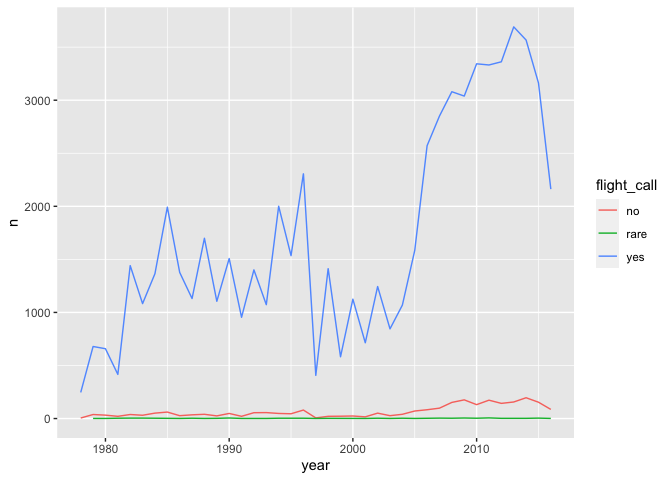
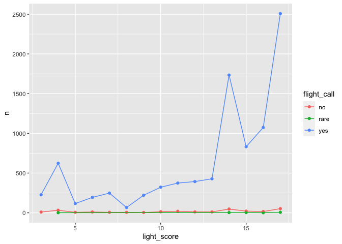
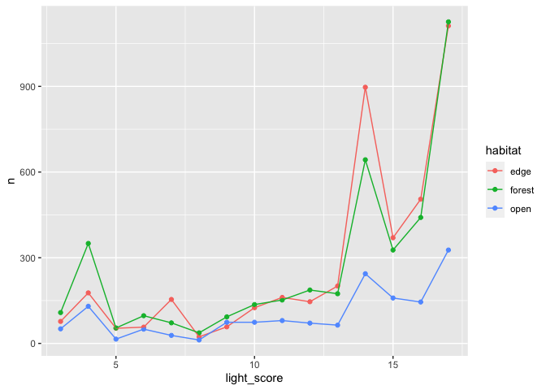
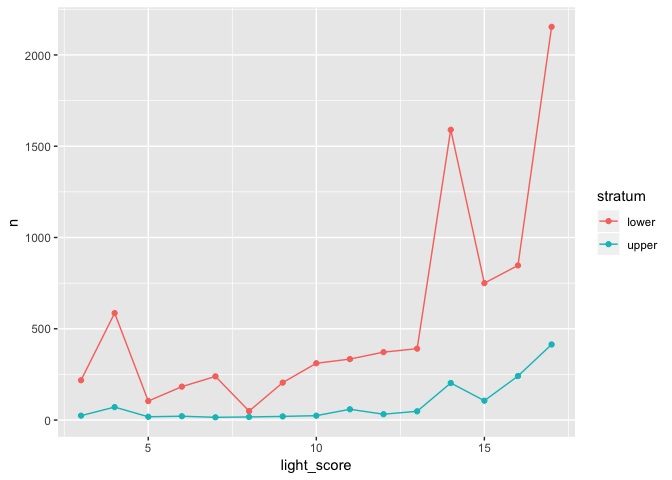

Bird collisions + light scores
================
Sara Altman
2019-08-13

``` r
# Packages
library(tidyverse)
library(lubridate)

# Parameters
file_data <- here::here("data/bird_collisions_light.rds")

#===============================================================================

# Read in data
df <- read_rds(file_data)

mccormick_place <- 
  df %>% 
  filter(locality == "McCormick Place")
```

## Summary

``` r
df %>% 
  summary()
```

    ##     genus             species               date           
    ##  Length:69812       Length:69812       Min.   :1978-09-15  
    ##  Class :character   Class :character   1st Qu.:1992-10-11  
    ##  Mode  :character   Mode  :character   Median :2006-09-06  
    ##                                        Mean   :2002-05-24  
    ##                                        3rd Qu.:2011-10-14  
    ##                                        Max.   :2016-11-30  
    ##                                                            
    ##    locality            family          flight_call       
    ##  Length:69812       Length:69812       Length:69812      
    ##  Class :character   Class :character   Class :character  
    ##  Mode  :character   Mode  :character   Mode  :character  
    ##                                                          
    ##                                                          
    ##                                                          
    ##                                                          
    ##    habitat            stratum           light_score   
    ##  Length:69812       Length:69812       Min.   : 3.00  
    ##  Class :character   Class :character   1st Qu.: 5.00  
    ##  Mode  :character   Mode  :character   Median :12.00  
    ##                                        Mean   :10.97  
    ##                                        3rd Qu.:16.00  
    ##                                        Max.   :17.00  
    ##                                        NA's   :28887

## Collisions over time by flight call

``` r
df %>% 
  count(year_month = floor_date(date, unit = "month"), flight_call) %>% 
  ggplot(aes(year_month, n, color = flight_call)) +
  geom_line()
```

<!-- -->

``` r
df %>% 
  count(year = floor_date(date, unit = "year"), flight_call) %>% 
  ggplot(aes(year, n, color = flight_call)) +
  geom_line()
```

<!-- -->

## Collisions by light score

``` r
mccormick_place %>% 
  filter(!is.na(light_score)) %>% 
  count(light_score, flight_call) %>% 
  ggplot(aes(light_score, n, color = flight_call)) +
  geom_point() +
  geom_line() 
```

<!-- -->

Birds with a flight call appear more affected by light.

``` r
mccormick_place %>% 
  filter(!is.na(light_score)) %>% 
  count(light_score, habitat) %>% 
  ggplot(aes(light_score, n, color = habitat)) +
  geom_point() +
  geom_line() 
```

<!-- -->

Birds across the three habitats have similar responses to light.

``` r
mccormick_place %>% 
  filter(!is.na(light_score)) %>% 
  count(light_score, stratum) %>% 
  ggplot(aes(light_score, n, color = stratum)) +
  geom_point() +
  geom_line() 
```

<!-- -->
