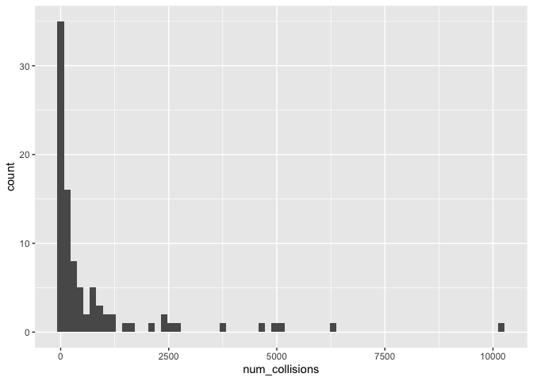
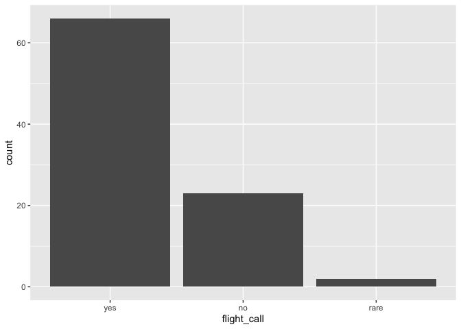
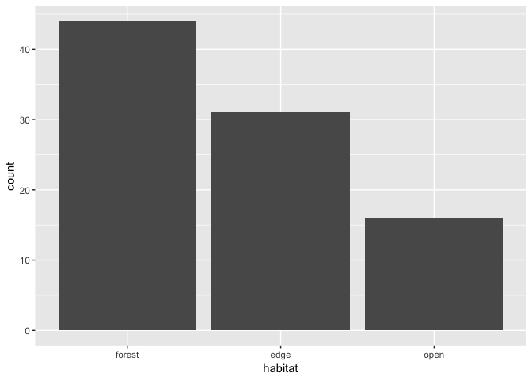
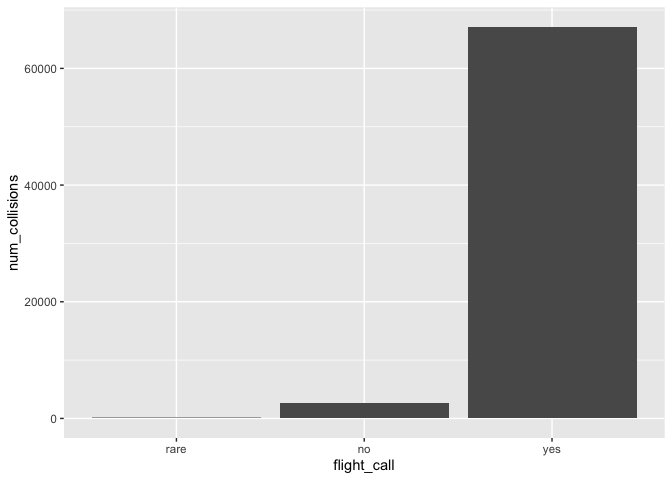
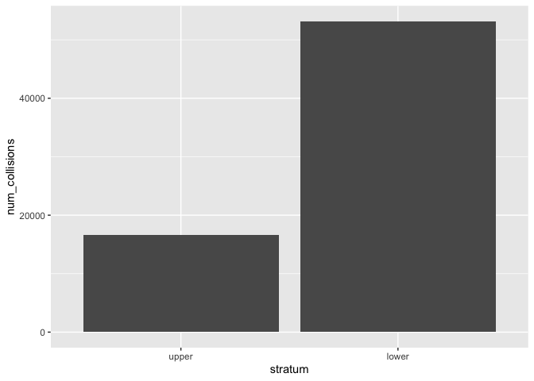
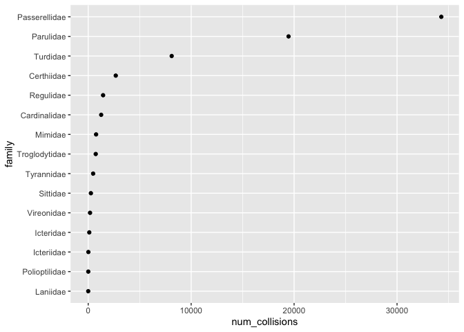
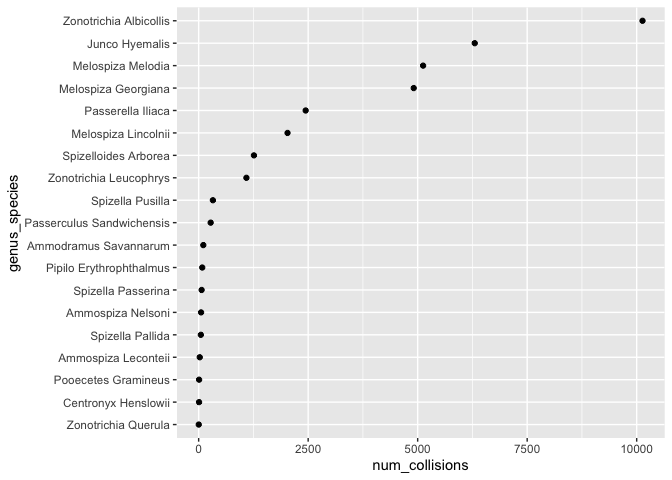

Birds
================
Sara Altman
2019-05-02

``` r
# Libraries
library(tidyverse)

# Parameters
file_data <- "data/birds.rds"

# ==============================================================================
birds <- read_rds(here::here(file_data))
```

# Summary

``` r
birds %>% 
  summary()
```

    ##     family             genus             species         
    ##  Length:91          Length:91          Length:91         
    ##  Class :character   Class :character   Class :character  
    ##  Mode  :character   Mode  :character   Mode  :character  
    ##                                                          
    ##                                                          
    ##                                                          
    ##  num_collisions    flight_call          habitat         
    ##  Min.   :    1.0   Length:91          Length:91         
    ##  1st Qu.:   21.0   Class :character   Class :character  
    ##  Median :  177.0   Mode  :character   Mode  :character  
    ##  Mean   :  766.9                                        
    ##  3rd Qu.:  726.0                                        
    ##  Max.   :10133.0                                        
    ##    stratum         
    ##  Length:91         
    ##  Class :character  
    ##  Mode  :character  
    ##                    
    ##                    
    ## 

``` r
birds %>% 
  select(family, genus, species) %>% 
  n_distinct()
```

    ## [1] 91

There are 91 disinct bird species.

``` r
birds %>% 
  keep(~ sum(is.na(.)) > 0)
```

    ## # A tibble: 91 x 0

There are no NAs in any column.

# 1D EDA

## Number of collisions

``` r
birds %>% 
  ggplot(aes(num_collisions)) +
  geom_histogram(binwidth = 150)
```

<!-- -->

Most species have a very small number of collisions.

``` r
birds %>% 
  count(num_collisions, sort = TRUE)
```

    ## # A tibble: 81 x 2
    ##    num_collisions     n
    ##             <dbl> <int>
    ##  1              6     3
    ##  2              1     2
    ##  3              2     2
    ##  4              4     2
    ##  5              9     2
    ##  6             12     2
    ##  7             15     2
    ##  8             16     2
    ##  9             68     2
    ## 10              3     1
    ## # … with 71 more rows

There are a couple of species with very high collision numbers.

``` r
birds %>% 
  filter(num_collisions > 5000)
```

    ## # A tibble: 3 x 7
    ##   family      genus     species  num_collisions flight_call habitat stratum
    ##   <chr>       <chr>     <chr>             <dbl> <chr>       <chr>   <chr>  
    ## 1 Passerelli… Zonotric… Albicol…          10133 yes         forest  lower  
    ## 2 Passerelli… Junco     Hyemalis           6303 yes         edge    lower  
    ## 3 Passerelli… Melospiza Melodia            5124 yes         edge    lower

Maybe these are very common birds in the Chicago area. The Passerellidae
family are sparrows.

## Flight call

``` r
birds %>% 
  count(flight_call, sort = TRUE)
```

    ## # A tibble: 3 x 2
    ##   flight_call     n
    ##   <chr>       <int>
    ## 1 yes            66
    ## 2 no             23
    ## 3 rare            2

Flight call has three possible values: yes, no, and rare. Most birds
have a flight call.

``` r
birds %>% 
  mutate(flight_call = fct_infreq(flight_call)) %>% 
  ggplot(aes(flight_call)) +
  geom_bar()
```

<!-- -->

## Habitat

``` r
birds %>% 
  count(habitat, sort = TRUE)
```

    ## # A tibble: 3 x 2
    ##   habitat     n
    ##   <chr>   <int>
    ## 1 forest     44
    ## 2 edge       31
    ## 3 open       16

``` r
birds %>% 
  mutate(habitat = fct_infreq(habitat)) %>% 
  ggplot(aes(habitat)) +
  geom_bar()
```

<!-- -->

## Stratum

``` r
birds %>% 
  count(stratum, sort = TRUE)
```

    ## # A tibble: 2 x 2
    ##   stratum     n
    ##   <chr>   <int>
    ## 1 upper      48
    ## 2 lower      43

More birds occupy the upper stratum than lower, but the numbers are
similar.

# 2D EDA

``` r
birds %>% 
  group_by(flight_call) %>% 
  summarize(num_collisions = sum(num_collisions)) %>% 
  mutate(flight_call = fct_reorder(flight_call, num_collisions)) %>% 
  ggplot(aes(flight_call, num_collisions)) +
  geom_col()
```

<!-- -->

The flight call birds have far more collisions than the non-flight call
birds, but there are also way more flight call species than non-flight
call species.

``` r
birds %>% 
  group_by(stratum) %>% 
  summarize(num_collisions = sum(num_collisions)) %>% 
  mutate(stratum = fct_reorder(stratum, num_collisions)) %>% 
  ggplot(aes(stratum, num_collisions)) +
  geom_col()
```

<!-- -->

The lower stratum birds have more collisions.

``` r
birds %>% 
  group_by(family) %>% 
  summarize(num_collisions = sum(num_collisions, na.rm = TRUE)) %>% 
  mutate(family = fct_reorder(family, num_collisions)) %>% 
  ggplot(aes(family, num_collisions)) +
  geom_point() +
  coord_flip()
```

<!-- -->

The Paserellidae family have the most collisions.

``` r
birds %>% 
  filter(family == "Passerellidae") %>% 
  unite(col = genus_species, genus, species, sep = " ") %>% 
  group_by(genus_species) %>% 
  summarize(num_collisions = sum(num_collisions, na.rm = TRUE)) %>% 
  mutate(genus_species = fct_reorder(genus_species, num_collisions)) %>% 
  ggplot(aes(genus_species, num_collisions)) +
  geom_point() +
  coord_flip()
```

<!-- -->

One particular species is driving most of the collisions in the
Passerellidae—Zonotrichia Albicolis
