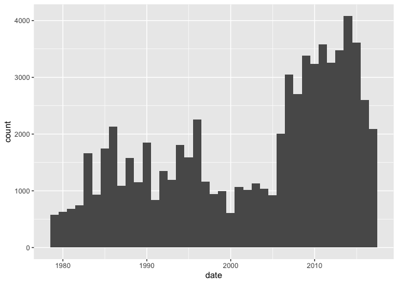
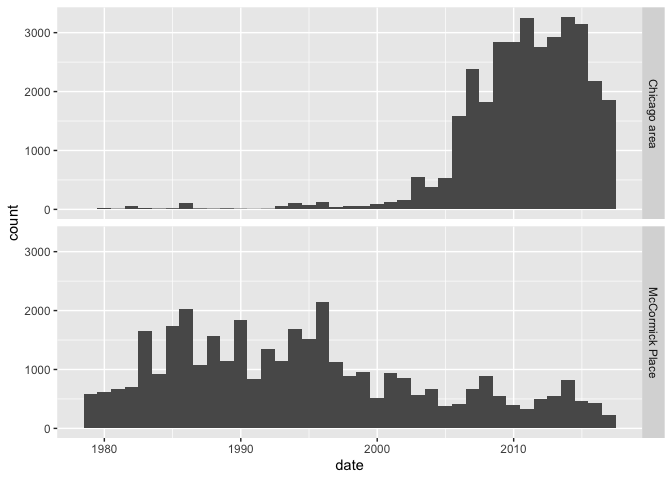

Bird collisions
================
Sara Altman
2019-05-07

``` r
# Library
library(tidyverse)
```

    ## Warning: package 'purrr' was built under R version 3.5.2

    ## Warning: package 'stringr' was built under R version 3.5.2

``` r
# Parameters
file_data <- here::here("data/collisions.rds")

#===============================================================================

collisions <- read_rds(file_data)
```

# Summaries

``` r
collisions %>% 
  summary()
```

    ##     genus             species               date           
    ##  Length:69784       Length:69784       Min.   :1978-09-15  
    ##  Class :character   Class :character   1st Qu.:1992-10-11  
    ##  Mode  :character   Mode  :character   Median :2006-09-06  
    ##                                        Mean   :2002-05-24  
    ##                                        3rd Qu.:2011-10-14  
    ##                                        Max.   :2016-11-30  
    ##    locality        
    ##  Length:69784      
    ##  Class :character  
    ##  Mode  :character  
    ##                    
    ##                    
    ## 

``` r
collisions %>% 
  summarize_all(~ sum(is.na(.)))
```

    ## # A tibble: 1 x 4
    ##   genus species  date locality
    ##   <int>   <int> <int>    <int>
    ## 1     0       0     0        0

There are no `NA`s.

# 1D EDA

``` r
collisions %>% 
  ggplot(aes(date)) +
  geom_histogram(binwidth = 250)
```

<!-- -->

It looks like the number of collisions is increasing.

``` r
collisions %>% 
  count(genus, species, sort = TRUE)
```

    ## # A tibble: 91 x 3
    ##    genus       species         n
    ##    <chr>       <chr>       <int>
    ##  1 Zonotrichia Albicollis  10133
    ##  2 Junco       Hyemalis     6303
    ##  3 Melospiza   Melodia      5124
    ##  4 Melospiza   Georgiana    4910
    ##  5 Seiurus     Aurocapilla  4580
    ##  6 Catharus    Guttatus     3729
    ##  7 Certhia     Americana    2676
    ##  8 Oreothlypis Peregrina    2515
    ##  9 Passerella  Iliaca       2443
    ## 10 Catharus    Ustulatus    2331
    ## # … with 81 more rows

``` r
collisions %>% 
  count(genus, sort = TRUE)
```

    ## # A tibble: 45 x 2
    ##    genus           n
    ##    <chr>       <int>
    ##  1 Melospiza   12063
    ##  2 Zonotrichia 11225
    ##  3 Catharus     7609
    ##  4 Junco        6303
    ##  5 Setophaga    6032
    ##  6 Seiurus      4580
    ##  7 Oreothlypis  4432
    ##  8 Certhia      2676
    ##  9 Passerella   2443
    ## 10 Geothlypis   2001
    ## # … with 35 more rows

``` r
collisions %>% 
  count(locality, sort = TRUE)
```

    ## # A tibble: 2 x 2
    ##   locality            n
    ##   <chr>           <int>
    ## 1 McCormick Place 36315
    ## 2 Chicago area    33469

There are two localities—McCormick Park and the general Chicago area.

# 2D EDA

``` r
collisions %>% 
  ggplot(aes(date)) +
  geom_histogram(binwidth = 500) +
  facet_grid(cols = vars(locality))
```

<!-- -->

Chicago collisions are increasing, but MP collisions actually look like
they are going down.
