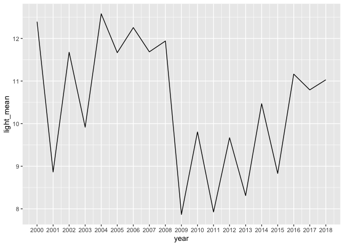

McCormick Place light scores
================
Sara Altman
2019-08-13

``` r
# Libraries
library(tidyverse)

# Parameters
file_data <- here::here("data/light_mp.rds")

#===============================================================================

# Read in data
light_mp <- read_rds(file_data)
```

## Summary

``` r
light_mp %>% 
  summary()
```

    ##       date             light_score   
    ##  Min.   :2000-03-06   Min.   : 3.00  
    ##  1st Qu.:2004-11-20   1st Qu.: 4.00  
    ##  Median :2009-09-04   Median :11.00  
    ##  Mean   :2009-07-17   Mean   :10.38  
    ##  3rd Qu.:2013-11-07   3rd Qu.:15.00  
    ##  Max.   :2018-05-26   Max.   :17.00

The light score is the “proportion of the 17 window bays that were
illuminated” \[1\]. The recordings all happened before dawn.

``` r
light_mp %>% 
  count(light_score, sort = TRUE)
```

    ## # A tibble: 15 x 2
    ##    light_score     n
    ##          <dbl> <int>
    ##  1          17   556
    ##  2           4   474
    ##  3          14   379
    ##  4           3   307
    ##  5          15   201
    ##  6          16   172
    ##  7           6   163
    ##  8           7   149
    ##  9           5   128
    ## 10          11   121
    ## 11          12   116
    ## 12           9    98
    ## 13          13    91
    ## 14          10    72
    ## 15           8    40

``` r
light_mp %>% 
  count(date, sort = TRUE)
```

    ## # A tibble: 3,062 x 2
    ##    date           n
    ##    <date>     <int>
    ##  1 2000-05-09     2
    ##  2 2003-09-02     2
    ##  3 2007-08-29     2
    ##  4 2009-09-18     2
    ##  5 2017-03-17     2
    ##  6 2000-03-06     1
    ##  7 2000-03-08     1
    ##  8 2000-03-10     1
    ##  9 2000-03-31     1
    ## 10 2000-04-02     1
    ## # … with 3,052 more rows

## 1D EDA

``` r
light_mp %>% 
  ggplot(aes(light_score)) +
  geom_histogram(binwidth = 1)
```

<!-- -->

Light tends to be either very low or very high.

``` r
light_mp %>% 
  ggplot(aes(date)) +
  geom_histogram(binwidth = 250)
```

<!-- -->

Data was collected pretty evenly across time.

## 2D EDA

``` r
light_mp %>% 
  group_by(date) %>% 
  summarize(light_score = median(light_score, na.rm = TRUE)) %>% 
  ggplot(aes(date, light_score)) +
  geom_col()
```

<!-- -->

``` r
light_mp %>% 
  filter(lubridate::year(date) > 2013) %>% 
  group_by(date) %>% 
  summarize(light_score = median(light_score, na.rm = TRUE)) %>% 
  ggplot(aes(date, light_score)) +
  geom_col()
```

<!-- -->

``` r
light_mp %>% 
  ggplot(aes(lubridate::month(date, label = TRUE))) +
  geom_bar()
```

<!-- -->

The researchers only measured the light of McCormick Place during bird
migration periods, which occur in the spring and autumn.

``` r
light_mp %>% 
  group_by(year = lubridate::year(date)) %>% 
  summarize(median_light = median(light_score, na.rm = TRUE)) %>% 
  ggplot(aes(year, median_light)) +
  geom_line() +
  scale_x_continuous(breaks = seq(2000, 2018, 1))
```

<!-- -->

``` r
light_mp %>% 
  group_by(month = lubridate::month(date, label = TRUE)) %>% 
  summarize(median_light = median(light_score, na.rm = TRUE)) %>% 
  ggplot(aes(month, median_light)) +
  geom_col() 
```

<!-- -->

\[^1\] Winger Benjamin M., Weeks Brian C., Farnsworth Andrew, Jones
Andrew W., Hennen Mary and Willard David E. Nocturnal flight-calling
behaviour predicts vulnerability to artificial light in migratory birds.
286. Proceedings of the Royal Society B: Biological Sciences.
<http://doi.org/10.1098/rspb.2019.0364>.
