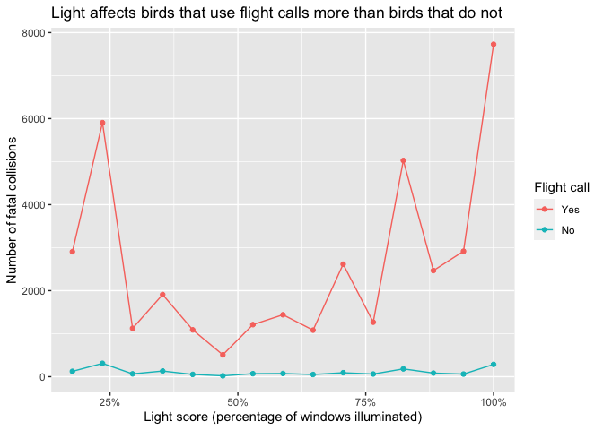

Report
================
Sara Altman
2019-08-13

``` r
# Packages
library(tidyverse)

# Parameters
file_data <- here::here("data/bird_collisions_light.rds")
  # Total number of window bays at McCormick Place; used to calculated light_score
num_windows <- 17

# ==============================================================================

df <- read_rds(file_data)
```

Birds that use flight calls appear more affected by increased light than
birds that do not use flight calls.

``` r
df %>% 
  filter(!is.na(light_score), flight_call != "rare") %>% 
  mutate(
    flight_call = 
      ordered(flight_call, levels = c("yes", "no"), labels = c("Yes", "No")),
    light_score = light_score / num_windows
  ) %>% 
  count(light_score, flight_call) %>% 
  ggplot(aes(light_score, n, color = flight_call)) +
  geom_point() +
  geom_line() +
  scale_color_hue() +
  scale_x_continuous(labels = scales::percent_format(accuracy = 1)) +
  labs(
    x = "Light score (percentage of windows illuminated)",
    y = "Number of fatal collisions",
    color = "Flight call",
    title = "Light affects birds that use flight calls more than birds that do not"
  )
```

<!-- -->
